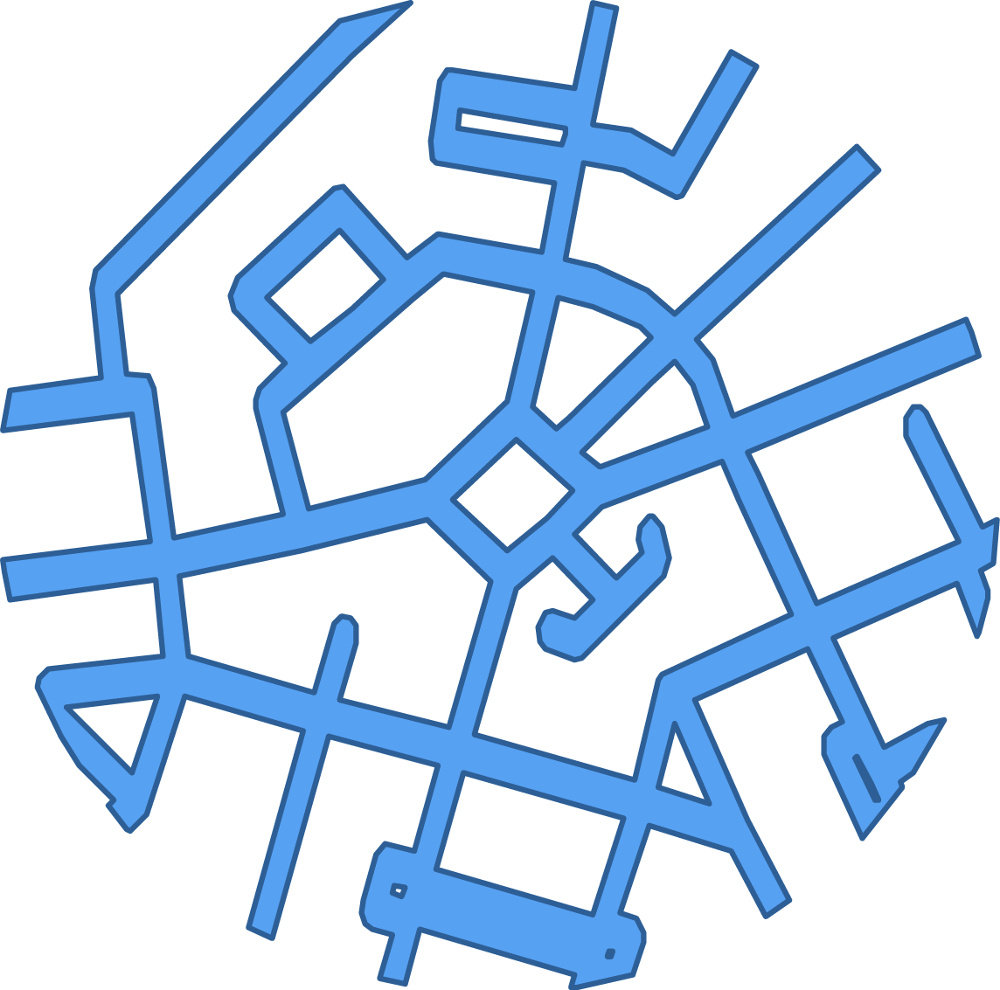

# Maptime Amsterdam #5: Street Patterns

[Take me to the tutorial](http://maptime-ams.github.io/street-patterns/)!

This is a tutorial on using <a href="http://wiki.openstreetmap.org/wiki/Key:highway">OpenStreetMap road data</a> to make <a href="http://dataphys.org/">physical visualizations</a> using <a href="http://fablab.waag.org/machines">Fablab equipment</a>. Follow along, and don&#39;t forget to click on all the links to read some background information!

Beautiful patterns can emerge from a city&#39;s street network (<a href="http://www.fredfeddes.nl/">Fred Feddes</a> told us today that some of the patterns in the streets of Amsterdam are more than a 1000 years old), and by using only open data and open source tools, we can extract those patterns, and visualize and <i>physicalize</i> them.

This tutorial was made by <a href="http://bertspaan.nl">Bert Spaan</a> for the <a href="http://www.meetup.com/Maptime-AMS/events/220184211/">fifth edition</a> of <a href="http://maptime-ams.github.io/">Maptime Amsterdam</a>, and should work with Chrome, Firefox and Safari. The source code is available on <a href="https://github.com/maptime-ams/street-patterns">GitHub</a>.

## License

MIT
